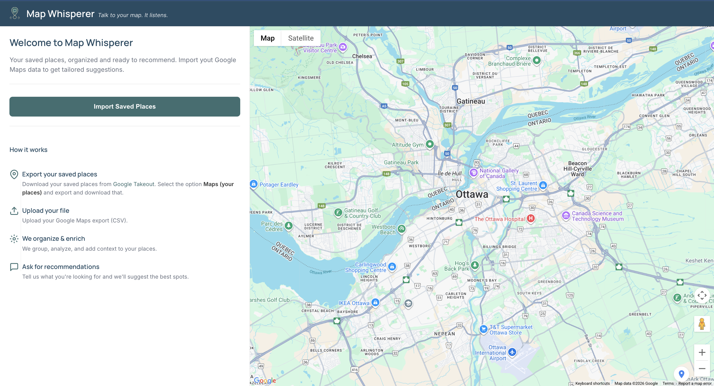

# 🗺️ Map Whisperer  
**No more “where should we go?”**

Map Whisperer helps you actually use your saved Google Maps places. Instead of endlessly scrolling through saved lists, you can filter them or simply ask what you’re in the mood for and get smart, ranked recommendations that make sense. Built with React.js and Node.js, the app transforms your saved spots into a conversational, decision-making experience. By combining Google Maps & Places APIs for place enrichment with Google Gemini AI for natural language understanding, Map Whisperer delivers context-aware recommendations that help you quickly choose the right place.

---

## 🧠 Inspiration

When trying to decide where to go from my saved places, I realized most maps help you save locations but don’t actually help you choose between them. Whether it’s picking a place to eat, meet friends, or explore, scrolling through long saved lists quickly becomes frustrating and overwhelming. I wanted a tool that helps people interact with their saved spots in a smarter way—by filtering, asking questions, and getting recommendations instead of guessing. Map Whisperer was built with a simple goal: help people make better decisions from the places they’ve already saved.

---

## ✨ What Map Whisperer Does

Map Whisperer turns your saved Google Maps places into something you can actually use.

- Import your saved places from Google Maps
- Use **filters** (like cuisine, price, or vibe) to narrow things down
- Or **chat naturally** to describe what you’re looking for
- The app understands your request, enriches your saved places with extra details, and returns a short, ranked list of recommendations
- No more decision fatigue, no more endless scrolling

---

## 💬 How It Works

1. Export your saved places from Google Maps (via Google Takeout)
2. Upload the file into Map Whisperer
3. Either:
   - apply filters, or  
   - chat with the app to describe what you want
4. Map Whisperer:
   - searches through your saved places
   - enriches them with additional context
   - ranks and explains the best matches

---

## 🛠️ How It Was Built

- **Frontend:** React  
- **Backend:** Node.js  
- **AI:** Google Gemini (for chat, intent understanding, ranking, and explanations)  
- **Maps & Places:** Google Maps & Places APIs (for enrichment like ratings, hours, and reviews)

---

## 🚀 Running Locally

Instructions coming soon.

---

*Built solo during a hackathon.*
